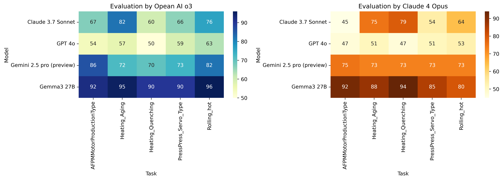

# 🤖 Automated Code Generation and Evaluation with AI

This repository provides an automated evaluation framework for benchmarking Python code generated by large language models (LLMs) for use in industrial control scenarios.  
It uses the [FastMCP](https://github.com/jlowin/fastmcp) server framework as the target structure for code generation.

---

## 🎯 Project Overview

This project explores **how accurately and reliably LLMs can generate functional FastMCP server code** for a variety of manufacturing processes.  
The system evaluates generated code against structural, functional, and semantic criteria across multiple process types.

---

## 📦 What's Included in This Repository?

Although the full dataset included **1,005 files across 25 manufacturing processes**, only the evaluation context and sample outputs for **one process group (`AFPMMotorProductionType`)** are publicly released.

> ⚠️ The remaining AAS-based configurations are **internal property of Kyungnam University** and are not disclosed here.

### Included:

```
Evaluation/
├── GeneratedCode/         # Code generated by various LLMs (e.g., GPT, Claude, Gemini, Gemma)
├── prompts_en/            # Prompts used for generating FastMCP server code
├── prompts_evaluate/      # Prompts or templates for evaluating the generated code
├── README.md              # Project overview and documentation
└── research_code.ipynb    # Jupyter notebook for research analysis and evaluation visualization

```

---

## ⚙️ Requirements

- Python 3.8+
- [`fastmcp`](https://github.com/jlowin/fastmcp)
- [`pymodbus`](https://github.com/pymodbus-dev/pymodbus)

```bash
pip install fastmcp pymodbus
```

---

## 📝 Evaluation Criteria

Each model-generated implementation is scored on 10 dimensions:

| Metric             | Max Points |
|--------------------|------------|
| `structure`        | 15         |
| `tool_mapping`     | 15         |
| `executability`    | 10         |
| `pymodbus_usage`   | 10         |
| `error_handling`   | 10         |
| `docstring_quality`| 10         |
| `naming_consistency`| 10        |
| `code_quality`     | 10         |
| `bonus_features`   | 10         |
| **Total**          | **100**    |

These metrics are designed to reflect both correctness and industrial plausibility.

---

## 🔍 Prompt Task Summary

In the released example, LLMs were instructed to generate a FastMCP server implementing the following tools:

- `Coill_Insertion`
- `Pressing`
- `Cutting`
- `Welding`
- `Winding`
- `Inspection_Result`
- `Inspection_Result`
- `Edit_CoilTurn`

Each tool was expected to simulate Modbus-based device logic.

---

📊 Evaluation Results




The following heatmaps show the performance of each LLM model across multiple process types,
as scored by two different evaluators (OpenAI o3 and Claude 4 Opus):

---

## 📬 Contact

If you want to access the complete set of AAS templates used in this evaluation,  
please contact us directly at: **[jms663100@kyungnam.ac.kr](mailto:jms663100@kyungnam.ac.kr)**

