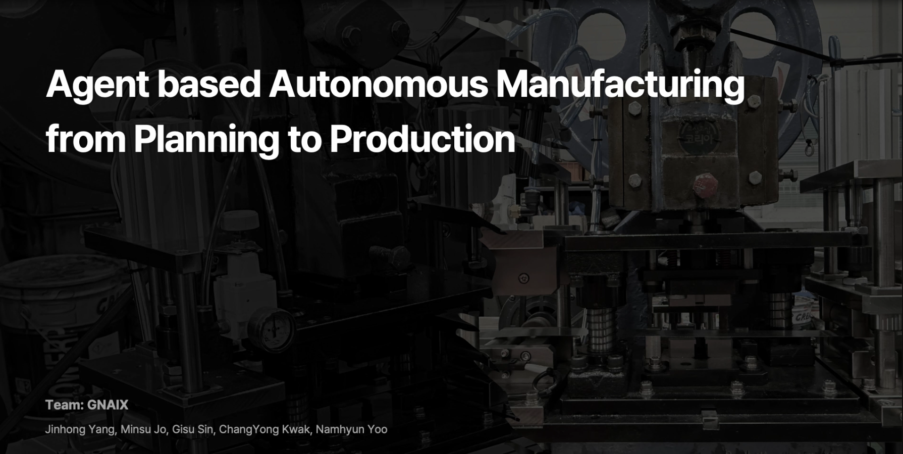

# 🤖 A2M: Agent-based Autonomous Manufacturing

This repository implements the system described in the paper  
**"Agent based Autonomous Manufacturing from Planning to Production: Experimental Study on Automatic Tool Generation and Control Using Large-Scale AAS Process Information"**.

It presents a fully functional agent-based autonomous manufacturing pipeline powered by LLMs, AAS, and MCP.

---

## 🏗️ Repository Overview

```
A2M/
├── AAS/                    # Asset Administration Shell files (partial public subset - AFPM only)
├── Evaluation/             # LLM code evaluation framework & prompts
├── FastMCP_Tools/          # Automatically generated MCP tools
├── AI_Agent/               # Agent interface for orchestration & command execution
├── AAS_Server/             # BaSyx-based API server for AAS registry, repo, and discovery
├── configs/                # IP, network and connection configurations
├── examples/               # Demonstration flows and template interactions
├── README.md              
└── LICENSE                 # Apache 2.0
```

---

## 📖 Project Summary

A2M is a practical framework that bridges **standardized industrial metadata (AAS)** with **AI planning and control (LLM Agents)**.  
The system:

1. Parses and classifies large-scale AAS files (4,588 total, 1,005 with common operations)
2. Prompts LLMs (Claude, GPT, Gemini, Gemma) to generate MCP tools for device control
3. Evaluates tool quality using structured, multi-dimensional criteria
4. Operates end-to-end AFPM motor production based on user natural language commands

> 🔒 Only AAS files related to **AFPM Motor Production** are included publicly.
> The full dataset belongs to **Kyungnam University** and is available upon request.


---

## 🧠 System Architecture

The following diagram shows the high-level architecture of A2M,  
connecting the AI Agent, AAS Server, MCP Server, and real manufacturing facility via a local network.


---

## 🧠 Key Components

### 1. 📁 AAS_Server (BaSyx)

- Based on BaSyxMinimal example
- Provides AAS Registry, Submodel Repo, and Discovery endpoints
- Acts as an **API metadata server** for the AI Agent and FastMCP

### 2. ⚙️ FastMCP_Tools

- Tools automatically generated by LLMs from AAS Operation submodels
- Implements dummy PLC control logic using `pymodbus`
- Controlled via the AI Agent at runtime

### 3. 🤖 AI Agent

- Orchestrates:
  - **Process discovery** via AAS registry
  - **Tool availability check** via FastMCP
  - **Tool invocation** from natural language
- Implements real-time monitoring and parameter mapping

### 4. 📊 Evaluation

- Prompts and scores generated tools across 10 criteria
- Visualization support for heatmaps and comparison tables
- Uses Claude and GPT-based evaluators

---

## 🧪 Case Study: AFPM Motor Production

- Conducted at ANYTOY Inc. with actual AFPM motor line
- Used Mitsubishi PLC and real AAS-mapped equipment
- Full workflow from `calculate_required_turns()` to `start_manufacturing()` validated

The A2M framework was deployed on a real AFPM motor manufacturing line at ANYTOY Inc.,  
integrating Mitsubishi PLCs, AAS-based tool modeling, and LLM-based orchestration.


---

### 🎥 Demo Video

Watch the full demo of A2M in operation on the actual AFPM motor line:

[▶️ Watch the Demo on YouTube](https://www.youtube.com/watch?v=alrfzhOwG-4)
---
[](https://www.youtube.com/watch?v=alrfzhOwG-4)

---

## 📬 Request Full AAS Dataset

This project only includes AFPM-related digital twins.  
To access the full 4,588-file AAS dataset:

📩 Email: **[jms663100@kyungnam.ac.kr](mailto:jms663100@kyungnam.ac.kr)**  


---
##  Project Contributors & Roles

### Gyeongnam Intelligence Innovation Center
| Name                | Role                                                                          |
|---------------------|--------------------------------------------------------------------------------|
| **Namhyun Yoon**    | Project Director                                                              |
| **Jinhong Yang**    | Overall System Architecture Design                                            |
| **HoanSuk Choi**    | Generation of Process-specific AAS Files & AAS API Design and Development     |
| **Minsu Jo**        | Agent Module Development & MCP Server Implementation                         |

### ANYTOY
| Name                | Role                                                        |
|---------------------|-------------------------------------------------------------|
| **Gisu Sin**       | AFPM Process—Overall System Architecture Design             |
| **Changyong Kwak**  | AFPM Process—PLC Code Development                           |


## 📜 License

Apache License 2.0

---
## Acknowledgments
This work was supported by the Institute of Information & Communications Technology Planning & Evaluation(IITP)-Innovative Human Resource Development for Local Intellectualization program grant funded by the Korea government(MSIT)(IITP-2025-RS-2024-00436773).

> Supported by IITP, MSIT (IITP-2025-RS-2024-00436773)
